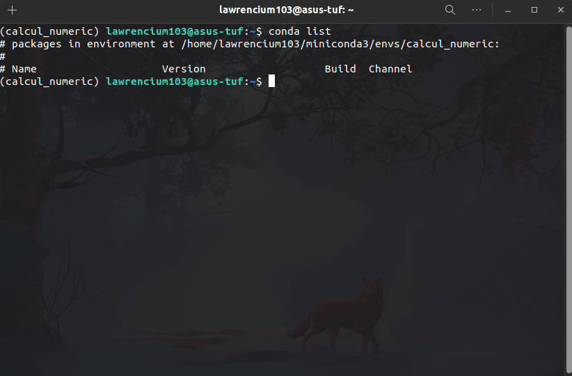

# Crearea unui nou mediu de lucru
Pentru a putea lucra cu librării externe, precum Numpy sau Matplotlib, este necesar să ne setăm un nou environment. Vom face acest lucru cu Miniconda.
Voi presupune că fiecare dintre voi are deja instalat Python pe computer-ul personal :smiley: .

În cele ce urmează vă voi prezenta câte o modalitate de instalare și setare a unui nou environment folosind Miniconda, atât pentru Windows, cât și pentru Linux / MacOS. 

Pentru exemplele următoare voi lăsa path-ul default, dacă doriți să setați alte locații pentru Miniconda sau environment, la setarea environment-ului în PyCharm veți selecta acea locație.

<br/><br/>

## Instalare pe Windows
### Instalare Miniconda
Accesăm link-ul https://docs.conda.io/en/latest/miniconda.html, iar din secțiunea următoare vom descărca versiunea pentru sistemul nostru de operare:


Deschidem fișierul și urmăm pașii de instalare(Next -> I Agree -> Next -> Next -> Install -> Next -> Finish) :


### Creare unui nou environment
Deschidem următorul terminal:


Pentru a crea environment-ul nostru, numit *calcul_numeric*, scriem următoarea comandă:


Pentru a activa mediul nostru proaspăt creat, vom scrie:


Pentru a vizualiza pachetele instalate în acest environment rulăm:


Instalarea pachetelor Numpy și Matplotlib:


### Setare environment în PyCharm
Pentru a alege environment-ul nou creat vom crea un nou proiect și vom selecta secțiunea **Previously configured interpreter** apăsăm pe cele trei puncte:


Se va deschide o nouă fereastră, în care din partea stângă selectăm **Conda Environment**, apoi din partea dreaptă selectăm **Existing environment**, iar la secțiunea **Interpreter** apăsăm pe cele trei puncte:


Se deschide o nouă fereastră unde vom selecta path-ul **C:\Users\nume_user\miniconda3\envs\calcul_numeric\python.exe**, unde *nume_user* reprezintă numele utilizatorului sistemului vostru de operare:


Tot ce mai rămăne de făcut: **OK > OK > CREATE**  :smiley:

Pentru verificare în proiectul nou creat, fișierul **main.py**, introducem următoarele linii de cod:
```python
import numpy  
import matplotlib.pyplot
```

Dacă nu primim nicio eroare, totul este setat corect.

**Good Job** :beer:


<br/><br/>

## Instalare pe Linux / MacOS
Deoarece și Linux și MacOS sunt sisteme de operare UNIX, iar instalarea este asemănătoare, le voi prezenta în paralel. 

### Instalare Miniconda
Accesăm link-ul https://docs.conda.io/en/latest/miniconda.html, iar din secțiunea următoare vom descărca versiunea pentru sistemul nostru de operare:


Fișierul nostru descărcat se numește *Miniconda3-latest-Linux-x86_64.sh* și vom rula următoarele comenzi în terminal:


**Enter**


**Enter până terminăm de parcurs termenii și condițiile**


**yes**


**Enter**

<br/>

### Creare unui nou environment
Rulăm următoarea comandă în terminal:


**Am creat un nou environment numic *calcul_numeric***


**y**


	
**Am activat environment-ul calcul_numeric**
<br/><br>

Pentru a vizualiza pachetele instalate în acest environment rulăm:



Instalarea pachetelor Numpy și Matplotlib:


	
<br/>

### Setare environment în PyCharm
Pentru a alege environment-ul nou creat vom crea un nou proiect și vom selecta secțiunea **Previously configured interpreter** apăsăm pe cele trei puncte:


Se va deschide o nouă fereastră, în care din partea stângă selectăm **Conda Environment**, apoi din partea dreaptă selectăm **Existing environment**, iar la secțiunea **Interpreter** apăsăm pe cele trei puncte:


Se deschide o nouă fereastră unde vom selecta path-ul **/home/nume_user/miniconda3/envs/calcul_numeric/bin/**, unde *nume_user* reprezintă numele utilizatorul sistemului vostru de operare:


Tot ce mai rămăne de făcut: **OK > OK > CREATE**  :smiley:

Pentru verificare în proiectul nou creat, fișierul **main.py**, introducem următoarele linii de cod:
```python
import numpy  
import matplotlib.pyplot
```

Dacă nu primim nicio eroare, totul este setat corect.

**Good Job** :beer:

<br/><br/>