# Librăria Matplotlib
Matplotlib este o librărie low-level pentru desenarea graficelor.
<br/>

## Importarea librăriei în script-uri
Pentru a importa librăria Matplotlib în script-urile noastre folosim:
```python
import matplotlib.pyplot as plt
```

## Inițializarea graficului
```python
plt.figure(0)
```

## Afișarea graficului
```python
plt.show()
```

## Plotarea unei funcții
Considerăm că avem un array de elemente **x** ce reprezintă valori de pe axa Ox și un array de elemente **y** ce reprezintă valori de pe axa Oy, plotarea acestei funcții se face cu **plot()**:
```python
plt.figure(0)
x = np.array([1,2,3,8])
y = np.array([4,1,6,2])
plt.plot(x, y, label='f(x)') # label='f(x)' reprezinta o eticheta ce va aparea pe grafic (nu este obligatorie, dar da bine)
plt.show()
```
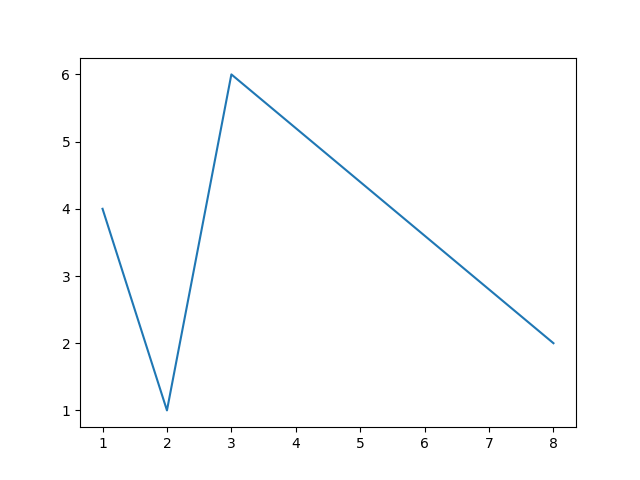

În cele ce urmează vă voi prezenta câteva elemente de design:
* **Markers**
Afișează punctele exacte sub diferite forme.
```python
plt.figure(0)
x = np.array([1,2,3,8])
y = np.array([4,1,6,2])
plt.plot(x, y, label= 'f(x)', marker= 'x')
plt.show()
```
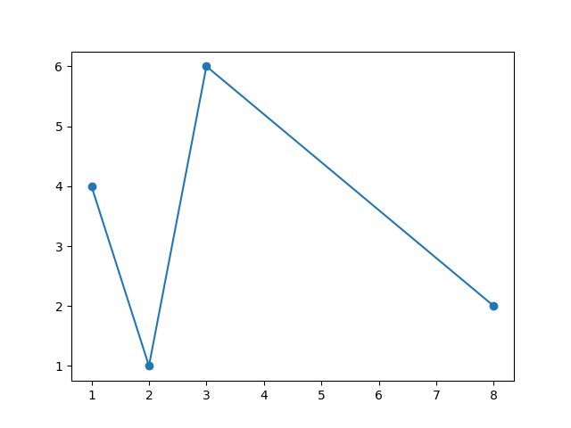

	*Câteva tipuri de markers:*
	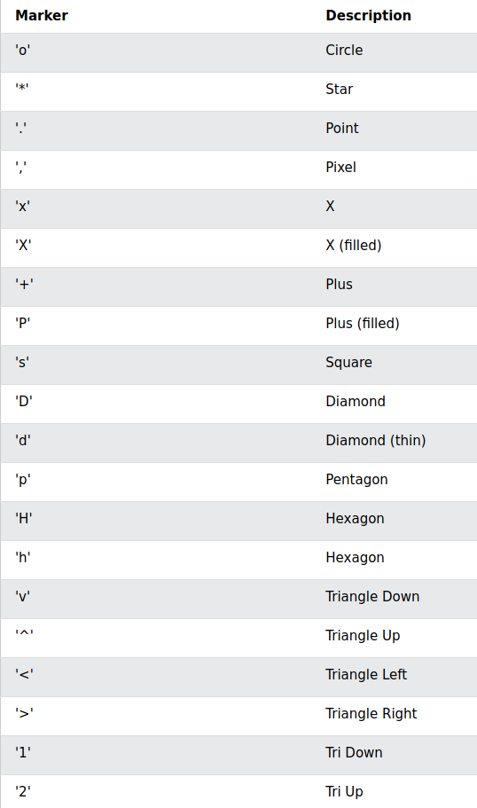
	
* **Lines**
Tipuri diferite de linie
1. Linestyle:
	```python
	plt.figure(0)
	x = np.array([1,2,3,8])
	y = np.array([4,1,6,2])
	plt.plot(x, y, label='f(x)', linestyle= 'dotted')
	plt.show()
	```
	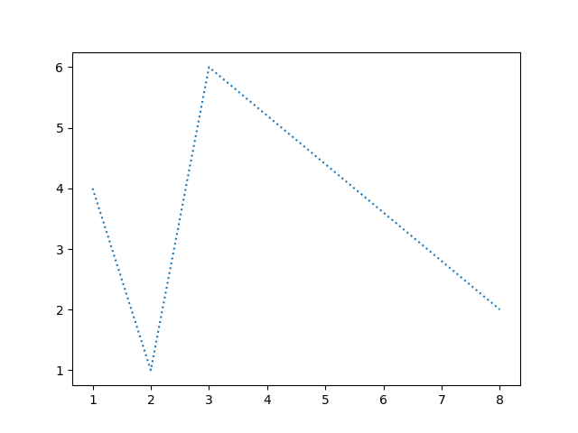
	
	*Tipuri de linii:*
	
	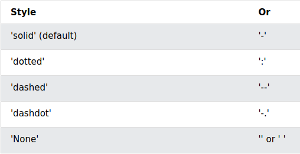
	
<br/>

2. Line color:
	```python
	plt.figure(0)
	x = np.array([1,2,3,8])
	y = np.array([4,1,6,2])
	plt.plot(x, y, label='f(x)', color= 'blue')
	plt.show()
	```
	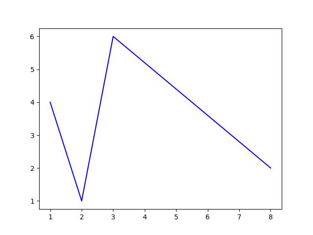
	
3. Line width:
	```python
	plt.figure(0)
	x = np.array([1,2,3,8])
	y = np.array([4,1,6,2])
	plt.plot(x, y, label='f(x)', linewidth= '15')
	plt.show()
	```
	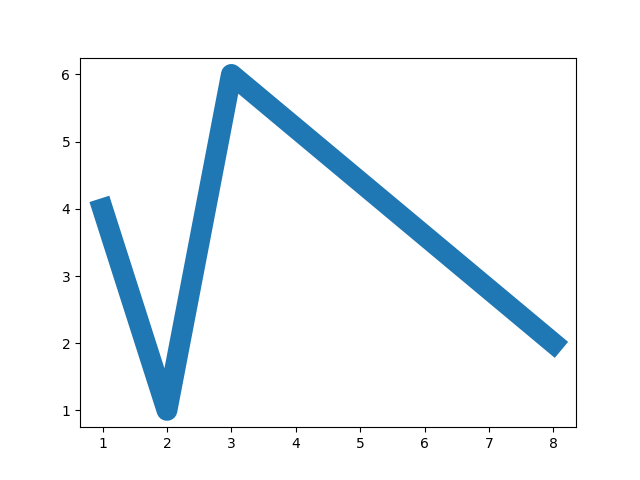
	
<br/>

## Notarea axelor și titlu
```python
plt.figure(0)
x = np.array([1,2,3,8])
y = np.array([4,1,6,2])
plt.plot(x, y, label='f(x)')

plt.title("Titlu grafic") # titlu
plt.xlabel("Axa Ox") # nume axa Ox
plt.ylabel("Axa Oy") # nume axa Ox

plt.show()
```

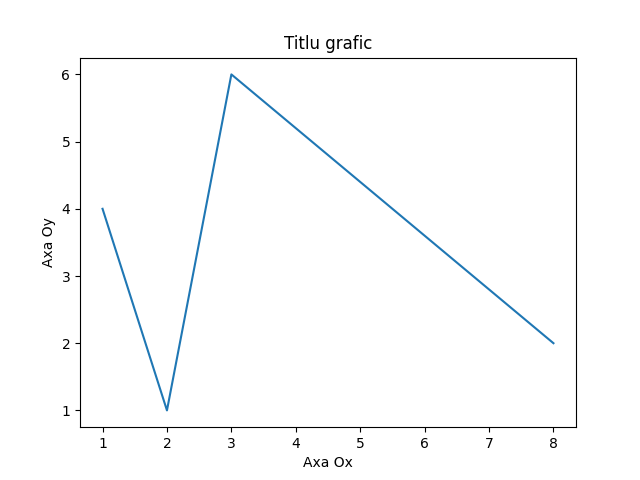

<br/>

## Grid
```python
plt.figure(0)
x = np.array([1,2,3,8])
y = np.array([4,1,6,2])
plt.plot(x, y, label='f(x)')

plt.grid()

plt.show()
```
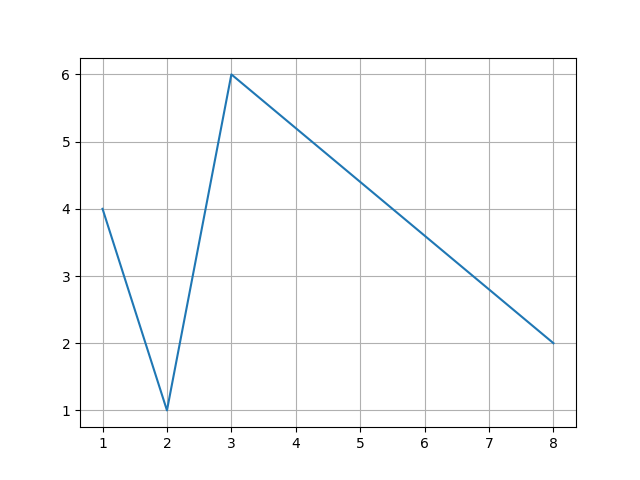

**Obs.** Grid-ul are aceleași atribute ca și o linie normală:
```python
plt.figure(0)
x = np.array([1,2,3,8])
y = np.array([4,1,6,2])
plt.plot(x, y, label='f(x)')

plt.grid(color='red', linestyle='--', linewidth=0.7)

plt.show()
```
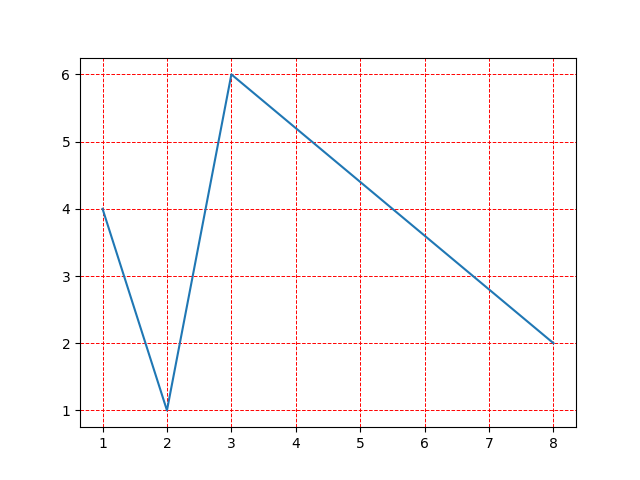

<br/>

## Scatter
```python
plt.figure(0)
x = np.array([1,2,3,8])
y = np.array([4,1,6,2])
plt.scatter(x, y, label='f(x)') # nu se mai afiseaza linii si/sau curbe, doar puncte
plt.show()
```
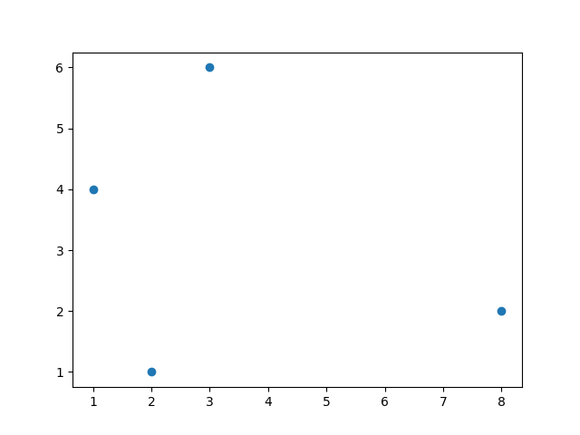

<br/>

## Alte funcții
```python
plt.legend() # afiseaza legenda graficului

plt.axvline(0, color='black') # afiseaza axa Oy
plt.axhline(0, color='black') # afiseaza axa Ox
```

<br/>

## Exemplu script desenare grafic
```python
import numpy as np  
import matplotlib.pyplot as plt  
  
  
def draw_graph(x, y):  
    plt.figure(0) # initializare grafic
	
    plt.plot(x, y, label='f(x)', color='red', marker='o', mfc='darkcyan', mec='darkcyan', linestyle=':', linewidth='2')  # plotarea graficului
  
    plt.title("Exemplu de grafic - f(x) = x^2 + ln(x)", color='crimson') # titlu
	
    plt.xlabel("Ox", color='darkcyan') # label axa Ox 
    plt.ylabel("Oy", color='darkcyan') # label axa Oy
  
    plt.axhline(0, color='black')  # reprezentare axa Ox
    plt.axvline(0, color='black')  # reprezentare axa OY
  
    plt.grid(color='pink', linewidth='0.7', linestyle=':')  #grid
	plt.legend()  # legenda
    plt.show()  # afisarea graficului
  
  
def func(x):  
    return x**2 + np.log(x)  
  
  
if __name__ == '__main__':  
    x = np.linspace(1, 30, 20) # discretizarea intervalului [1,30] in 20 de puncte 		echidistante  
 	y = func(x)  
    draw_graph(x,y)
```
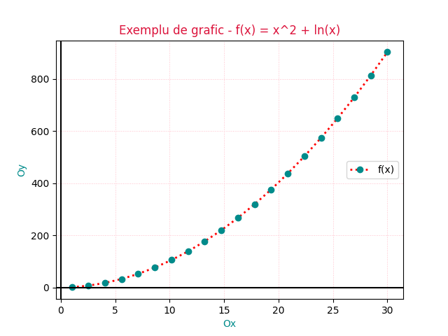

<br/>

## Exerciții
Fie funcția f(x) = x^3 - 2x^2 - 19x + 20,  x aparține intervalului [-6,6]. Crează o figură nouă în care vei afișa graficul funcției, ținând cont de:
1. Graficul funcției se va afișa folosind linie punctată de culoare galbenă
2. Graficul va include evidențierea axelor Ox și Oy
3. Discretizarea domeniului se va face folosind 97 de puncte echidistante
4. Graficul va include titlu, grid și legenda
5. Numărul figurii create va fi 6
6. Graficul va include și notarea axelor Ox și Oy

```python
import numpy as np  
import matplotlib.pyplot as plt  
  
  
def draw_graph(x, y):  
    plt.figure(6)  
    plt.plot(x, y, label='f(x)', color='yellow', linestyle=':', linewidth='3')  
  
    plt.title("Functie")  
    plt.xlabel("Ox")  
    plt.ylabel("Oy")  
  
    plt.axhline(0, color='black')  
    plt.axvline(0, color='black')  
  
    plt.grid()  
    plt.legend()  
    plt.show()  
  
  
def func(x):  
    return x**3 - 2*x**2 - 19*x + 20  
  
  
if __name__ == '__main__':  
    x = np.linspace(-6, 6, 97)  
    y = func(x)  
    draw_graph(x,y)
```
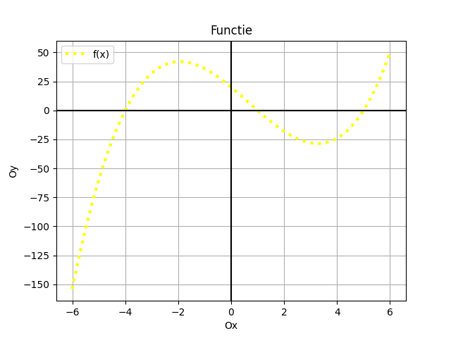
